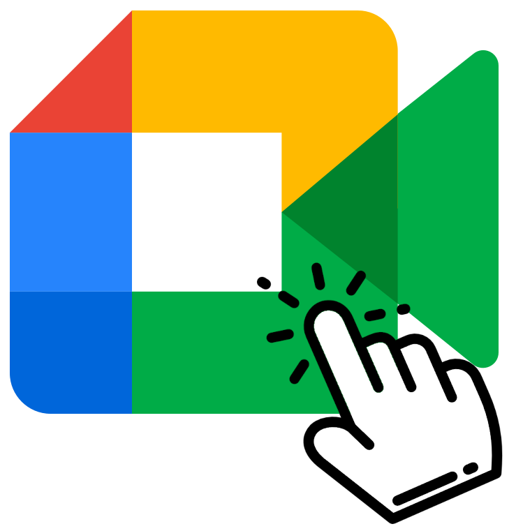

<h1 align="center">
    
</h1>

<h4 align="center">
  	Click to meet
</h4>

## 💻 Projeto

**Chrome's extension to create meet's link with just one click**

## Install
- Open settings/extensions

    

Settings

- Click on Load unpacked and select this folder

    

Load unpacked

- Pin Click to meet

    

Pin Click to meet

